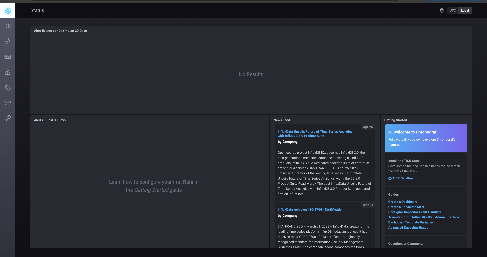
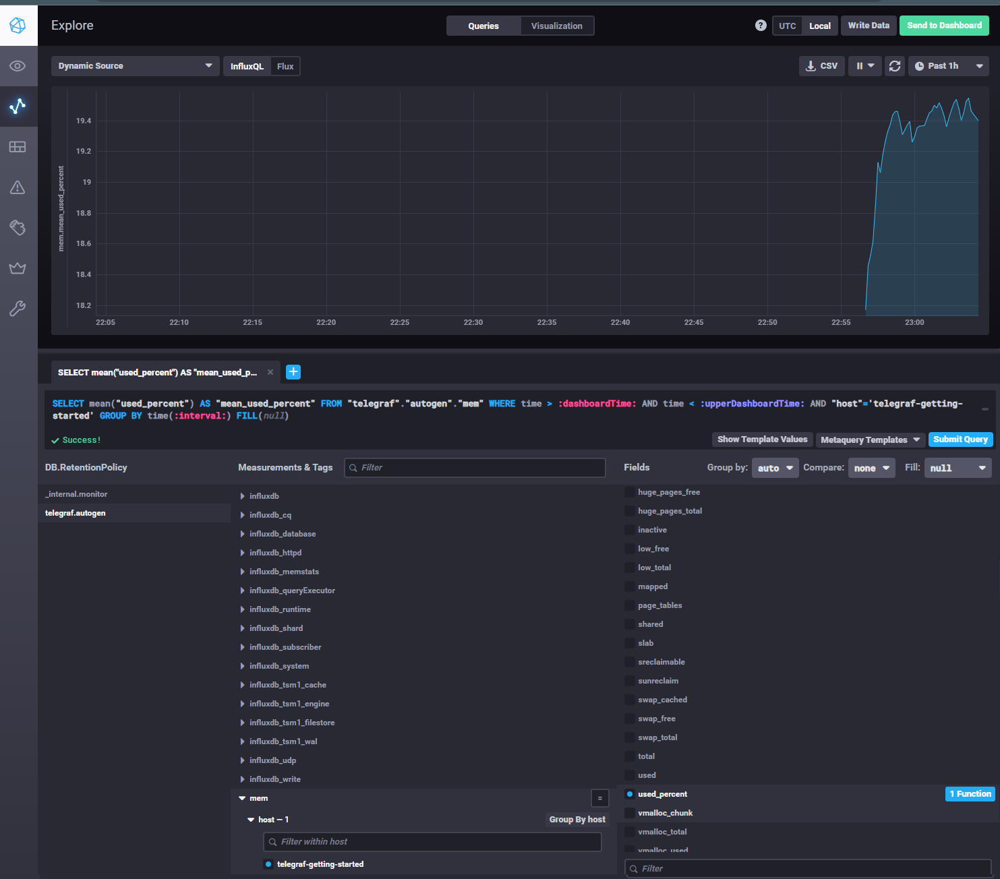
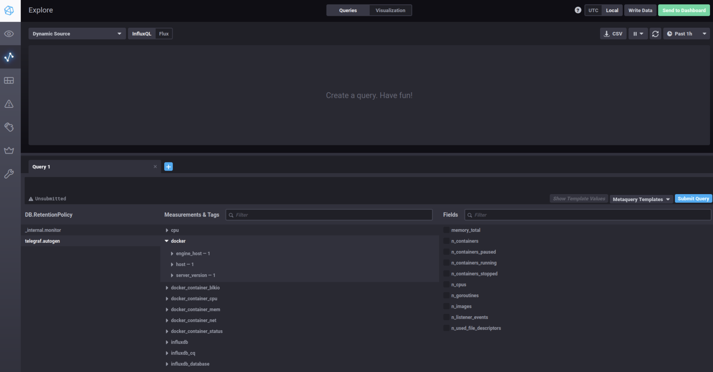

# Домашнее задание к занятию "13.Системы мониторинга"

## Обязательные задания

1. Вас пригласили настроить мониторинг на проект. На онбординге вам рассказали, что проект представляет из себя 
платформу для вычислений с выдачей текстовых отчетов, которые сохраняются на диск. Взаимодействие с платформой 
осуществляется по протоколу http. Также вам отметили, что вычисления загружают ЦПУ. Какой минимальный набор метрик вы
выведите в мониторинг и почему?

    **Ответ:**

    - Загрузка ЦПУ (%)
    - объем свободного места на диске < 10%
    - free inodes <10%
    - нагрузка на диск (iostat) > 95% в течение 1 часа
    - заполнение SWAP > 90%
    - RAM > 85% от доступного объема
    - Количество HTTP/S запросов к приложению
    - коды ответа HTTP (4xx и 5xx)
    - время ответа HTTP 
#
2. Менеджер продукта посмотрев на ваши метрики сказал, что ему непонятно что такое RAM/inodes/CPUla. Также он сказал, 
что хочет понимать, насколько мы выполняем свои обязанности перед клиентами и какое качество обслуживания. Что вы 
можете ему предложить?

    **Ответ:**

    - RAM - загруженность оперативной памяти
    - inodes - загруженность файловой системы 
    - CPUla - показатель загруженности CPU
    - Нужно утвердить SLA в рамках, которого будут указаны SLO метрик, после чего менежджеру будет видна понятная разница между значениями SLO и SLI.
    - Если значения SLI метрики не противоречат установленным SLO - продукт ОК.
#
3. Вашей DevOps команде в этом году не выделили финансирование на построение системы сбора логов. Разработчики в свою 
очередь хотят видеть все ошибки, которые выдают их приложения. Какое решение вы можете предпринять в этой ситуации, 
чтобы разработчики получали ошибки приложения?

    **Ответ:**
    
    - Можно использовать ELK или Greylog

#
4. Вы, как опытный SRE, сделали мониторинг, куда вывели отображения выполнения SLA=99% по http кодам ответов. 
Вычисляете этот параметр по следующей формуле: summ_2xx_requests/summ_all_requests. Данный параметр не поднимается выше 
70%, но при этом в вашей системе нет кодов ответа 5xx и 4xx. Где у вас ошибка?
    
    **Ответ:**

    - Лучше использовать формулу SLI = (summ_1x_requests + summ_2x_requests + summ_3x_requests)/(summ_all_requests) 

#
5. Опишите основные плюсы и минусы pull и push систем мониторинга.

    **Ответ:**

    Плюсы pull-систем мониторинга
    - Централизованное управление (сервер мониторинга сам запрашивает метрики у целей)
    - Простота отладки (можно вручную запросить метрики и проверить, что отдает приложение)
    - Поддерживается автообнаружение целей, нет необходимости настраивать агентов на каждой цели
    - Безопаснее в плане получения ложных данных (метрики приходят только при запросе сервера, исключается проблема «спама» мониторинга)
    - Низкий риск перегрузки сервера мониторинга (сервер инициирует сбор, он же и сам контролирует нагрузку)

    Минусы pull-систем мониторинга
    - Требуется открытый доступ к целям (сервер мониторинга должен иметь сетевой доступ ко всем приложениям)
    - Не подходит для краткоживущих задач (такие процессы могут завершиться до того, как их успеют опросить)
    - Нет встроенной буферизации (если цель недоступна в момент запроса — метрики теряются)
    - Масштабируемость может быть ограничена нагрузкой на сервер мониторинга.

    Плюсы push-систем мониторинга
    - Не требует открытых портов на целях (метрики отправляются из приложения наружу)
    - Подходит для краткоживущих задач (задача может завершиться быстро, но успеть отправить метрики перед завершением)
    - Буферизация метрик (push-агенты могут временно хранить метрики при потере связи с сервером)
    - Проще масштабировать

    Минусы push-систем мониторинга
    - Сложнее контролировать поток данных (возможны перегрузки при большом числе источников)
    - Меньше прозрачности и сложнее отладка (нужно логировать, проверять агентов, следить что бы они не «молчали»)
    - Безопасность (клиенты могут заспамить сервер мониторинга ложными данными)
#
6. Какие из ниже перечисленных систем относятся к push модели, а какие к pull? А может есть гибридные?

    - Prometheus 
    - TICK
    - Zabbix
    - VictoriaMetrics
    - Nagios

    **Ответ:**

    - Prometheus - Pull (но можно сделать гибридную при помощи Pushgateway)
    - TICK - Push
    - Zabbix - Гибридная
    - VictoriaMetrics - Гибридная
    - Nagios - Pull (Гибридная через плагины)
#
7. Склонируйте себе [репозиторий](https://github.com/influxdata/sandbox/tree/master) и запустите TICK-стэк, 
используя технологии docker и docker-compose.

В виде решения на это упражнение приведите скриншот веб-интерфейса ПО chronograf (`http://localhost:8888`). 

P.S.: если при запуске некоторые контейнеры будут падать с ошибкой - проставьте им режим `Z`, например
`./data:/var/lib:Z`

  **Ответ:**

  

#
8. Перейдите в веб-интерфейс Chronograf (http://localhost:8888) и откройте вкладку Data explorer.
        
    - Нажмите на кнопку Add a query
    - Изучите вывод интерфейса и выберите БД telegraf.autogen
    - В `measurments` выберите cpu->host->telegraf-getting-started, а в `fields` выберите usage_system. Внизу появится график утилизации cpu.
    - Вверху вы можете увидеть запрос, аналогичный SQL-синтаксису. Поэкспериментируйте с запросом, попробуйте изменить группировку и интервал наблюдений.

Для выполнения задания приведите скриншот с отображением метрик утилизации cpu из веб-интерфейса.

  **Ответ:**

  

#
9. Изучите список [telegraf inputs](https://github.com/influxdata/telegraf/tree/master/plugins/inputs). 
Добавьте в конфигурацию telegraf следующий плагин - [docker](https://github.com/influxdata/telegraf/tree/master/plugins/inputs/docker):
```
[[inputs.docker]]
  endpoint = "unix:///var/run/docker.sock"
```

Дополнительно вам может потребоваться донастройка контейнера telegraf в `docker-compose.yml` дополнительного volume и 
режима privileged:
```
  telegraf:
    image: telegraf:1.4.0
    privileged: true
    volumes:
      - ./etc/telegraf.conf:/etc/telegraf/telegraf.conf:Z
      - /var/run/docker.sock:/var/run/docker.sock:Z
    links:
      - influxdb
    ports:
      - "8092:8092/udp"
      - "8094:8094"
      - "8125:8125/udp"
```

После настройке перезапустите telegraf, обновите веб интерфейс и приведите скриншотом список `measurments` в 
веб-интерфейсе базы telegraf.autogen . Там должны появиться метрики, связанные с docker.

Факультативно можете изучить какие метрики собирает telegraf после выполнения данного задания.

  **Ответ:**

  

## Дополнительное задание (со звездочкой*) - необязательно к выполнению

1. Вы устроились на работу в стартап. На данный момент у вас нет возможности развернуть полноценную систему 
мониторинга, и вы решили самостоятельно написать простой python3-скрипт для сбора основных метрик сервера. Вы, как 
опытный системный-администратор, знаете, что системная информация сервера лежит в директории `/proc`. 
Также, вы знаете, что в системе Linux есть  планировщик задач cron, который может запускать задачи по расписанию.

Суммировав все, вы спроектировали приложение, которое:
- является python3 скриптом
- собирает метрики из папки `/proc`
- складывает метрики в файл 'YY-MM-DD-awesome-monitoring.log' в директорию /var/log 
(YY - год, MM - месяц, DD - день)
- каждый сбор метрик складывается в виде json-строки, в виде:
  + timestamp (временная метка, int, unixtimestamp)
  + metric_1 (метрика 1)
  + metric_2 (метрика 2)
  
     ...
     
  + metric_N (метрика N)
  
- сбор метрик происходит каждую 1 минуту по cron-расписанию

Для успешного выполнения задания нужно привести:

а) работающий код python3-скрипта,

б) конфигурацию cron-расписания,

в) пример верно сформированного 'YY-MM-DD-awesome-monitoring.log', имеющий не менее 5 записей,

P.S.: количество собираемых метрик должно быть не менее 4-х.
P.P.S.: по желанию можно себя не ограничивать только сбором метрик из `/proc`.

2. В веб-интерфейсе откройте вкладку `Dashboards`. Попробуйте создать свой dashboard с отображением:

    - утилизации ЦПУ
    - количества использованного RAM
    - утилизации пространства на дисках
    - количество поднятых контейнеров
    - аптайм
    - ...
    - фантазируйте)
    
    ---

### Как оформить ДЗ?

Выполненное домашнее задание пришлите ссылкой на .md-файл в вашем репозитории.

---

